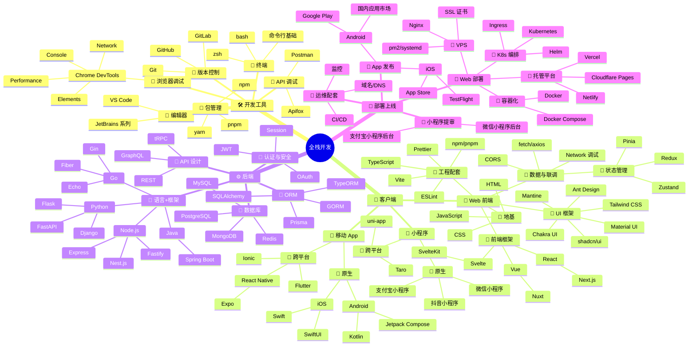

# 全栈开发路线图

```mermaid
mindmap
  root((全栈开发))
    🛠 开发工具
      📁 版本控制
        Git
        GitHub
        GitLab
      📁 编辑器
        VS Code
        JetBrains 系列
      📁 终端
        命令行基础
        bash
        zsh
      📁 浏览器调试
        Chrome DevTools
          Elements
          Console
          Network
          Performance
      📁 API 调试
        Postman
        Apifox
      📁 包管理
        npm
        pnpm
        yarn
    📱 客户端
      📁 Web 前端
        📁 地基
          HTML
          CSS
          JavaScript
        📁 前端框架
          React
            Next.js
          Vue
            Nuxt
          Svelte
            SvelteKit
        📁 UI 框架
          Tailwind CSS
          shadcn/ui
          Mantine
          Ant Design
          Material UI
          Chakra UI
        📁 数据与联调
          fetch/axios
          📁 状态管理
            Redux
            Zustand
            Pinia
          CORS
          Network 调试
        📁 工程配套
          TypeScript
          Vite
          npm/pnpm
          ESLint
          Prettier
      📁 移动 App
        📁 原生
          iOS
            Swift
            SwiftUI
          Android
            Kotlin
            Jetpack Compose
        📁 跨平台
          React Native
            Expo
          Flutter
          Ionic
      📁 小程序
        📁 原生
          微信小程序
          支付宝小程序
          抖音小程序
        📁 跨平台
          Taro
          uni-app
    ⚙️ 后端
      📁 语言+框架
        Node.js
          Express
          Fastify
          Nest.js
        Python
          FastAPI
          Django
          Flask
        Go
          Gin
          Echo
          Fiber
        Java
          Spring Boot
      📁 API 设计
        REST
        GraphQL
        tRPC
      📁 数据库
        PostgreSQL
        MySQL
        MongoDB
        Redis
      📁 认证与安全
        JWT
        OAuth
        Session
      📁 ORM
        Prisma
        TypeORM
        SQLAlchemy
        GORM
    🚀 部署上线
      📁 Web 部署
        📁 托管平台
          Vercel
          Netlify
          Cloudflare Pages
        📁 VPS
          Nginx
          pm2/systemd
          SSL 证书
        📁 容器化
          Docker
          Docker Compose
        📁 K8s 编排
          Kubernetes
          Helm
          Ingress
      📁 App 发布
        iOS
          App Store
          TestFlight
        Android
          Google Play
          国内应用市场
      📁 小程序提审
        微信小程序后台
        支付宝小程序后台
      📁 运维配套
        CI/CD
        监控
        域名/DNS
```
