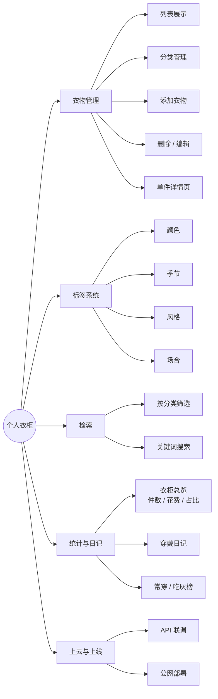
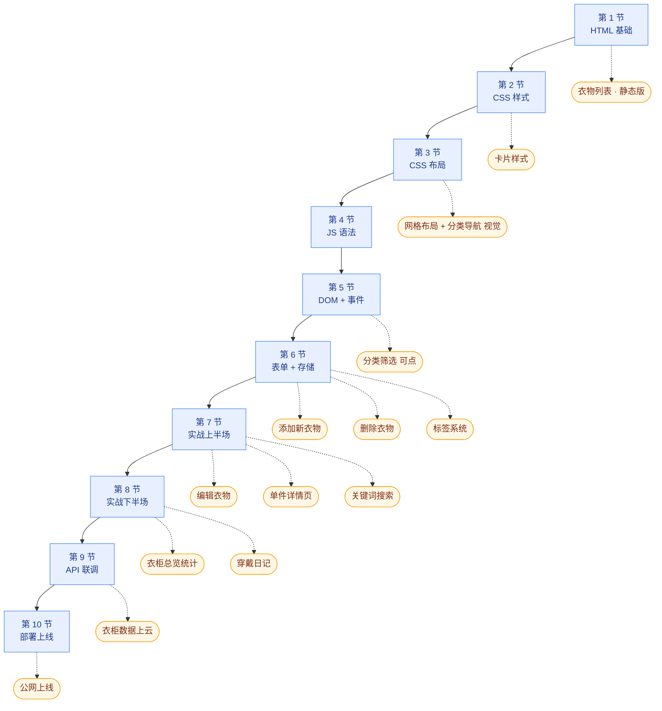

# 前端 Web 开发零基础教学路线图 · 个人衣柜项目

面向**完全零基础**的朋友。整个课程围绕一个贯穿项目展开——**个人衣柜**。
每节课往这个项目上加一层能力，学完能拿到一个自己用得上的小工具，并能像前端工程师一样和后端协作。

**课程定位**：完整学习**前端开发**；**不学后端**——只学怎么和后端配合（看接口文档、调 API、排查联调问题）。

预计 10 节课，每节 1-1.5 小时（含作业），每周 1-2 节。**节奏原则：少量讲解 + 多动手练习。**

---

## 一、最终要做出来什么

一个能在浏览器里跑、数据可本地可上云、最终部署到公网的"个人衣柜"网站。功能全景如下：

---

## 二、功能点清单

| #  | 功能 | 难度 | 在哪节做 |
| -- | --- | --- | --- |
| 1  | 衣物列表展示(图 + 名 + 分类) | ★ | 1 / 2 / 3 |
| 2  | 分类管理(上衣 / 裤子 / 鞋 / 外套 / 配饰) | ★ | 3 / 5 |
| 3  | 添加新衣物 | ★★ | 6 |
| 4  | 删除 / 编辑衣物 | ★★ | 6 / 7 |
| 5  | 按分类筛选 | ★★ | 5 |
| 6  | 单件衣物详情页 | ★★ | 7 |
| 7  | 标签(颜色 / 季节 / 风格 / 场合) | ★★ | 6 |
| 8  | 搜索(按名称、标签) | ★★ | 7 |
| 9  | 穿戴日记 + 常穿/吃灰统计 | ★★★ | 8 |
| 10 | 衣柜统计(总数 / 总花费 / 分类占比) | ★★ | 8 |
| 11 | 衣柜数据上"云"(API 联调) | ★★★ | 9 |
| 12 | 公网部署上线 | ★★ | 10 |

---

## 三、学习路径与功能交付

横向是 10 节课的顺序，每节课用虚线指向它解锁的功能点。

---

## 四、大纲

### 第 1 节 · HTML 基础：搭出衣柜首页 ✅

- **学什么**：网页是什么 / HTML、CSS、JS 分工 / 常用标签（`h1`-`h6`、`p`、`a`、`img`、`ul`/`li`）
- **做什么**：用纯 HTML 写出衣柜首页静态版，衣物信息写死在 HTML 里
- **课件**：[01-web-basics.md](01-web-basics.md)

### 第 2 节 · CSS 基础：让衣柜变好看 ✅

- **学什么**：CSS 选择器、外部样式表、盒模型、常用样式属性、伪类与过渡
- **做什么**：给衣柜首页加 `style.css`，做出卡片样式、配色、字体、悬浮反馈
- **课件**：[02-css-basics.md](02-css-basics.md)

### 第 3 节 · CSS 布局：用 Flex 排成网格 ✅

- **学什么**：块级 vs 行内、**Flex 布局（重点）**、响应式与媒体查询、Grid（简单介绍）
- **做什么**：把衣物卡片排成响应式网格、做出顶部分类导航栏（视觉先做出来，下节才能点）；手机视图切换为单列
- **课件**：[03-css-layout.md](03-css-layout.md)

> 重点是 Flex，已覆盖衣柜所有布局；Grid 只做认识层面的介绍，将来真需要时再深入。

### 第 4 节 · JavaScript 入门：基础语法

- **学什么**：脚本引入、Console 调试、变量与基本类型、控制流、函数、数组、对象；末尾轻量接触 DOM
- **做什么**：
  - 在 Console 里把衣物用 JS 对象数组表示，写函数过滤/统计这个数组
  - 末尾小试身手：用 JS 改网页标题、弹窗显示"衣柜里有 N 件衣物"、把数量显示到页面某个 `
` 里
- **课件**：[04-js-basics.md](04-js-basics.md)

> 主要学语法，末尾留 10-15 分钟让朋友看到 "JS 真能改网页"，下节系统学 DOM。

### 第 5 节 · DOM + 事件：让分类能点

- **学什么**：DOM 查询、事件监听、修改元素内容/样式、用模板字符串动态渲染列表
- **做什么**：把衣物从 HTML 搬到 JS 数组里，由 JS 渲染卡片；点击顶部分类标签筛选衣物
- **课件**：[05-dom-events.md](05-dom-events.md)

### 第 6 节 · 表单 + 本地存储：能添加、能删除

- **学什么**：表单元素、读取与提交、`localStorage` 持久化（含 **JSON 序列化**）、数组的增删
- **做什么**：写一个"添加新衣物"表单（名称、分类、图片、标签、价格），数据存进 `localStorage`，刷新还在；每个衣物卡片加删除按钮
- **课件**：[06-forms-storage.md](06-forms-storage.md)

### 第 7 节 · 实战上半场：搜索 + 详情 + 编辑

- **学什么**：字符串匹配、数组筛选、弹窗式详情页（定位与遮罩）、表单回填实现编辑
- **做什么**：
  - 顶部搜索框，输入关键词实时筛选衣物
  - 点击衣物卡片打开详情（卡片展开或弹窗）
  - 在详情里可以修改衣物信息，改完存回 `localStorage`
- **课件**：[07-search-detail-edit.md](07-search-detail-edit.md)

### 第 8 节 · 实战下半场：统计 + 穿戴日记

- **学什么**：数组聚合、`Date` 对象、日期型数据存储
- **做什么**：
  - 衣柜总览卡片：总件数、总花费、各分类占比
  - 穿戴日记：选日期、勾选今天穿了哪几件，存到 `localStorage`
  - 统计"近 30 天常穿榜 / 吃灰榜"
- **课件**：[08-stats-diary.md](08-stats-diary.md)

### 第 9 节 · API 调用：用 fetch 跟后端联调

- **学什么**：前后端分工 / API 与接口文档 / JSON / `fetch` + `async/await` / 4 种 HTTP 方法（GET 读 / POST 增 / PUT 改 / DELETE 删）/ 浏览器 Network 面板 / 常见错误（404、500、CORS）排查
- **做什么**：
  - 老师课前已搭好"衣柜后端"并预置测试数据，课上发**接口文档**给朋友
  - 用 `fetch` GET 把云端衣柜读出来渲染到页面
  - 把添加 / 编辑 / 删除从 `localStorage` 改成调 API（POST / PUT / DELETE）
  - 边做边看 Network 面板观察请求和响应
  - 故意造错误（断网、改错 URL、改错参数）练习排查
  - 简单介绍 Postman / Apifox
- **课件**：[09-api-integration.md](09-api-integration.md)

> 学生**不需要自己搭后端**——老师准备好接口和文档。核心：fetch 是通用工具，4 种 HTTP 方法只是 `method` 不同；体验"对着接口文档调"是什么感觉。

### 第 10 节 · 部署上线：把衣柜发布到公网

- **学什么**：Git/GitHub 基础（仓库、`commit`、`push`）、GitHub Pages 或 Vercel 一键部署
- **做什么**：项目推 GitHub → Vercel 一键部署 → 拿公网链接，发给朋友打开
- **课件**：[10-deployment.md](10-deployment.md)
